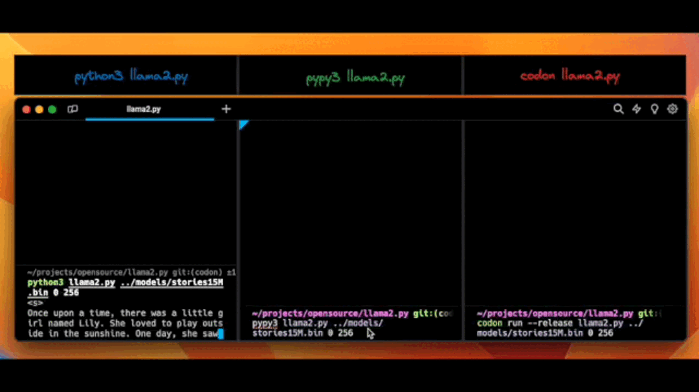

## llama2.py

[](https://colab.research.google.com/github/tairov/llama2.py/blob/master/llama2.ipynb)

## demo

<p align="center">
  
</p>

## why this fork?

This repository serves as a fork that provides a Python-based implementation of `llama2.c`. Designed for an extensive
audience, it aims to be a straightforward "reference implementation" suitable for educational purposes.

The current `llama2.c` repository comprises two Python files intended for model training and one C file for inference.
Our goal is to bridge the existing gap by offering a clear-cut reference implementation encapsulating all transformer
logic within a concise Python file, not exceeding 500 lines of code.

Though the original Facebook/llama is written on Python, its complexity is rather high due to multiple dependencies and
sophisticated optimizations implemented within. This often makes it hard to follow, particularly for those new to the
field.

## feel the magic

First, navigate to the folder when you keep your projects and clone this repository to this folder:

```bash
git clone https://github.com/tairov/llama2.py.git
```

Then, open the repository folder:

```bash
cd llama2.py
```

Now, let's just run a baby Llama 2 model in Python

```bash
wget https://huggingface.co/karpathy/tinyllamas/resolve/main/stories15M.bin
```

Just run the Python

```bash
python3 llama2.py stories15M.bin 0.8 256 "Dream comes true this day"
<s>
Dream comes true this day. To their surprise. A big game was easy and everyone was going on the day. Jack and they were playing beneath: life, free, butter! There was the time to think of the universe. There was very happy, fun and the joy and the following down below of this day they were there was a lot of a wide, new camping.
Jack and they had happened. The town was the saving up above the camp of the waves shor of their laughter, friendly journey of friendship to one. The night sky show of the end. Little ceremony, happy again.
<s>
 Once upon his family of a big day when Jack. They were filled foreshadowed happy and they were the joy filled this, different: the King of their appreciation they were to a wave to the spring limit. They were becoming Ruby, happy and the sunset of life of an amazing friendship and he had a robot.
<s>
 Once upon a 4, happy to the wonderful experience of the celebration of their friendship. Even the playground.
Jack and Sammy fishing adventure foreshium of a wishing being free time, happy. The generous adventure foreshly made it. The chance to
achieved tok/s: 1.3463711338028914
```

## use as a package

[PyPi llama2-py](https://pypi.org/project/llama2-py/)

```bash
pip install llama2-py==0.0.6
# make sure model & tokenizer are in the same folder
wget https://huggingface.co/karpathy/tinyllamas/resolve/main/stories15M.bin
wget https://github.com/tairov/llama2.py/raw/master/tokenizer.bin
```

```python
>> > import llama2_py
>> > llama2_py.run({"checkpoint": "stories15M.bin", "temperature": 0.0, "steps": 256, "prompt": None})
< s >
Once
upon
a
time, there
was...
```

## performance

__Performance is awful at the moment.__
UPD. Performance was significantly improved by using pypy interpretation or codona compilation.

While in native python interpreter it could be clocking around 1.3 tok/sec, in pypy it's 32 tok/sec and in codona it's
50 tok/s

HW spec: Apple M1 Max

| Implementation | tok/sec |
|----------------|---------|
| native python  | 1.3     |
| pypy           | 32      |
| codona         | 50      |


## installing and running with PyPy

```bash

# Download and extract PyPy
# Check what latest version their is for your OS and CPU architecture from https://www.pypy.org/download.html
cd ..
# E.g: on 64-bit Linux:
wget https://downloads.python.org/pypy/pypy3.10-v7.3.15-linux64.tar.bz2
# Extract the archive:
tar -xvf pypy3.10-v7.3.15-linux64.tar.bz2
cd llama2.py
# Run the script with PyPy
../pypy3.10-v7.3.15-linux64/bin/pypy llama2.py stories15M.bin 0.8 256 "Dream comes true this day"
``` 

## citing llama2.py

If you use or discuss `llama2.py` in your academic research, please cite the project to help spread awareness:

```
@misc{llama2.py,
  author = {Aydyn Tairov}, 
  title = {Inference Llama2 in one file of pure Python},
  year = {2023},
  month = {07},
  howpublished = {\url{https://github.com/tairov/llama2.py}},
  note = {Llama2.py, MIT License}
}
```

We kindly request that you include a link to the GitHub repository in published papers. This will allow interested
readers to easily find the latest updates and extensions to the project.

`llama2.py` aims to encourage academic research on efficient implementations of transformer architectures, the `llama`
model, and Python implementations of ML applications. Citing the project helps growth of the knowledge community around
these topics. We appreciate your support through referencing `llama2.py`!

## license

MIT
